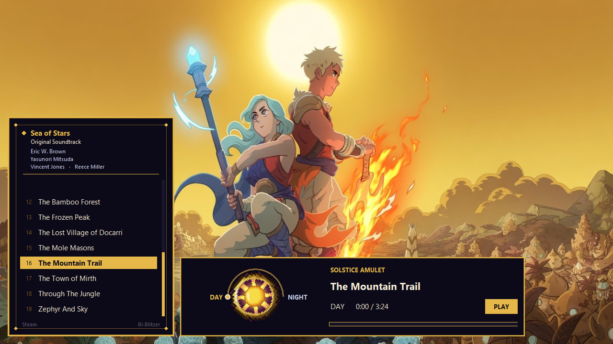
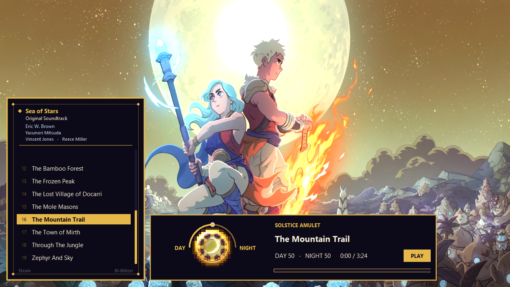
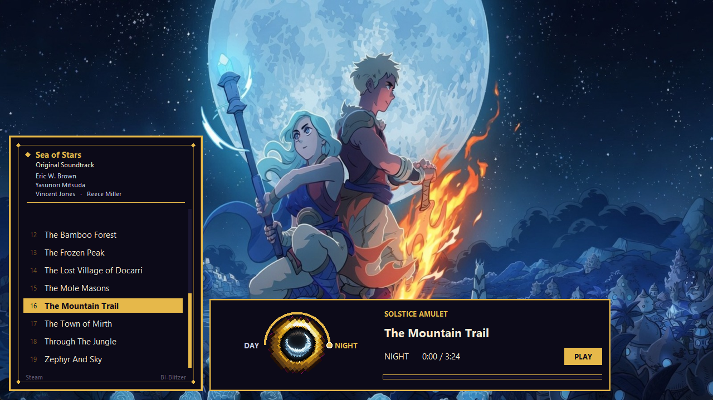

# Solstice Amulet

An unofficial player for the day and night arrangements in the [Sea of Stars](https://store.steampowered.com/app/1244090/Sea_of_Stars/) soundtrack.

In the game, once you have the Solstice Amulet, outdoor music keeps both arrangements running and only the volumes move. This player does the same thing on your own copies of the tracks. Drag the amulet from Day toward Night and both stems stay on the same beat.







Sea of Stars is a game by [Sabotage Studio](https://sabotagestudio.com/). The music is by Eric W. Brown and the soundtrack's guest composers. This project is not affiliated with or endorsed by them.

## Buy the soundtrack

The music is not included here, and this player will not download it. Install **Sea of Stars - OST** from Steam, then open this window and it will read the files Steam already put on your machine.

**[Sea of Stars - OST on Steam](https://store.steampowered.com/app/2550490/Sea_of_Stars__OST/)**

That purchase is the whole soundtrack, including the day and night pairs and the later tracks from Throes of the Watchmaker. The Steam page recommends playing the game before browsing the files, so you don't spoil the story for yourself.

The game itself is a separate purchase: [Sea of Stars on Steam](https://store.steampowered.com/app/1244090/Sea_of_Stars/).

## Run it

Python 3.11 or newer.

```
pip install -r requirements.txt
python player.py
```

By default the player looks in:

```
C:\Program Files (x86)\Steam\steamapps\music\Sea of Stars - OST
```

If Steam keeps the soundtrack somewhere else, pass that folder:

```
python player.py --library "D:\Music\Sea of Stars - OST"
```

`python player.py --test` checks that the day/night pairs still match and that playback moves without the dial dragging the playhead along with it.

The list is the day/night pairs only. It reads the mp3 copies and leaves the rest of the album alone.

## The window

Drag the amulet left toward Day or right toward Night. It stays where you let go. The wheel and the arrow keys nudge it. The words Day and Night ease the rest of the way to that side. Pause holds an ease that is still moving.

The score on the left is the pair list. Up and down move through it. Space plays and pauses. The bar under the title seeks both arrangements together.

## Pictures

The paintings in `skin/` are unofficial fan art, made so the window has Zale, Valere, and a solstice amulet to turn. They are not art from the game, and they are not covered by the code license in `LICENSE`.

## License

The original code is MIT, with a hard line around what that grant does not include. Sea of Stars, its name, its characters, and its music stay with their owners. Read `LICENSE` before you copy any of this elsewhere.
